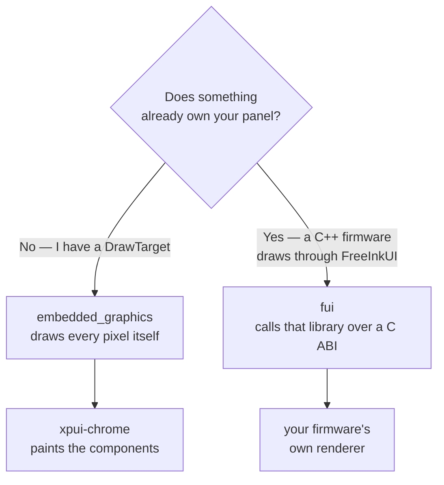
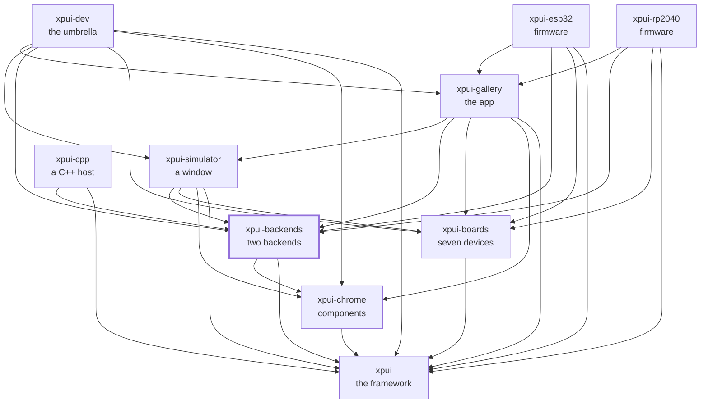

[](https://github.com/XPUI-Framework/xpui-backends/actions/workflows/ci.yml) [](LICENSE)

<picture>
  <source media="(prefers-color-scheme: dark)" srcset="assets/logo-black.png">
  
</picture>

# Backends

> [!WARNING]
> Under heavy development. Not production-ready. The API can break without
> notice. Use at your own risk.

The two things that put `xpui` pixels on a panel, and the two helpers they
need. A backend answers five traits — `Canvas`, `TextMetrics`, `Chrome`,
`InputSource`, `Clock` — and the framework calls nothing else; in practice you
write four, because `Chrome` comes from a macro, and the sixth trait a running
screen needs, `Navigator`, is the application's. Which of the two backends you
want depends on one question: **does something already own your panel?**

Every document in this repository is listed in [docs/README.md](docs/README.md).

## Which crate you want



| | |
|---|---|
| [`embedded_graphics`](embedded_graphics/) | You have a `DrawTarget` — a driver crate, a display over SPI, a simulator window. The backend draws every pixel itself, through [`xpui-chrome`](https://github.com/XPUI-Framework/xpui-chrome) |
| [`fui`](fui/) | A **C++ firmware** already owns the screen and draws through [FreeInkUI](https://github.com/Free-Ink/freeink-sdk/tree/main/libs/ui/FreeInkUI). This one calls that library over a C ABI, so a Rust screen comes out pixel-identical to a native one |
| [`screenshot`](screenshot/) | A framebuffer and golden-image comparison, for testing what a backend actually painted. Host only |
| [`abi-check`](abi-check/) | Parses a C header and the Rust that declares it and compares **signatures**. Two swapped parameters link fine — C has no mangling to disagree with — and the result is a corrupt call frame |

[docs/choosing-a-backend.md](docs/choosing-a-backend.md) is the same choice
at length, and what a third backend would need.

## Using it

```toml
[dependencies]
xpui-embedded-graphics = { git = "https://github.com/XPUI-Framework/xpui-backends", branch = "main" }
# or
xpui-fui = { git = "https://github.com/XPUI-Framework/xpui-backends", branch = "main" }

[dev-dependencies]
xpui-screenshot = { git = "https://github.com/XPUI-Framework/xpui-backends", branch = "main", features = ["golden"] }
```

Both backends in one repository costs a consumer nothing: cargo resolves per
crate, so a manifest naming `xpui-fui` compiles `xpui-fui` alone. The crates
depend on [`xpui`](https://github.com/XPUI-Framework/xpui-framework), and the
`embedded_graphics` backend on [`xpui-chrome`](https://github.com/XPUI-Framework/xpui-chrome)
for its themed components. **No boards crate**, by design: a backend takes its
measurements from whoever wires it and has no idea what a device is. Nothing
is on [crates.io](https://crates.io/) yet, which is why the dependency above is a `git` URL.

## Requirements

A Rust toolchain for everything but `fui`'s C++ half, which needs two more
things. **[clang-format](https://clang.llvm.org/docs/ClangFormat.html) 21 or newer is required**: the gate's second stage
fails without it, and refuses an older one rather than trusting it. **The
FreeInkUI headers are optional**: the gate takes `FREEINK_SDK_INCLUDE` when
it is set, otherwise looks beside the checkout, and skips the shim's two
stages with a note when it finds neither — except on CI, which fetches the
pinned revision and fails rather than skips.
[docs/contributing.md](docs/contributing.md) says where it looks, and why a
checkout found there is not the pinned revision.

## Checking it

```bash
./build-and-test.sh
```

The checks themselves are in [`xtask/`](xtask/) — this repository's own list,
in Rust, holding nothing it does not run. `./build-and-test.sh fix` formats
in place first, Rust and C++ both. How a change is reviewed is in
[docs/contributing.md](docs/contributing.md).

## Where it sits

Every arrow is a dependency in a `Cargo.toml`, and they all point inward
toward `xpui`, which depends on nothing at all. That is the rule the
organisation is arranged around: a backend can be written without the framework
knowing it exists, and a firmware reaches whatever it needs directly rather
than through whoever happens to sit above it.



## License

MIT — see [LICENSE](LICENSE). Copyright (c) 2026 Thiago Holanda.
