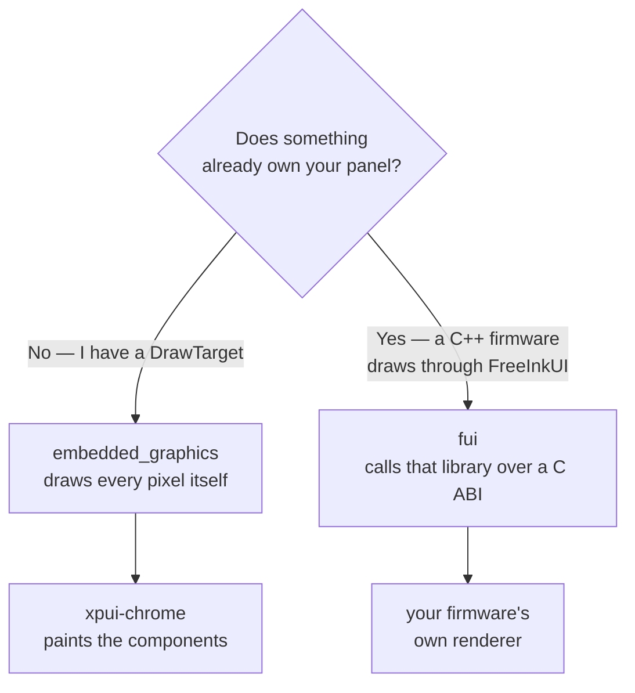
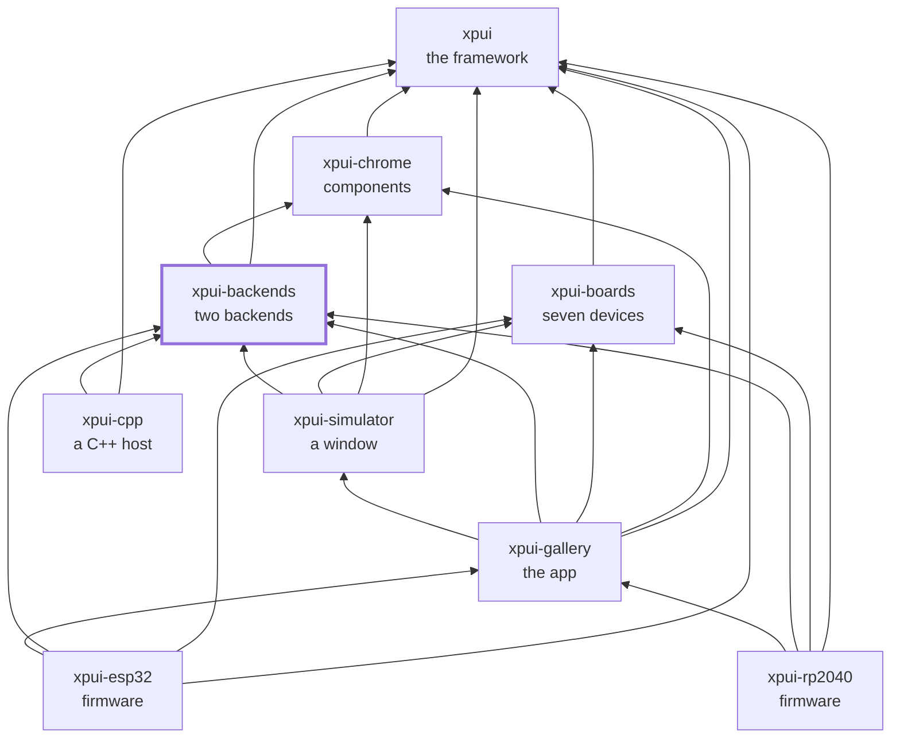

# `xpui-backends`

> ⚠️ **Under heavy development.** Not production-ready. The API can break
> without notice. Use at your own risk.

The two things that put `xpui` pixels on a panel, and the two helpers they
need.

A backend answers five traits — `Canvas`, `TextMetrics`, `Chrome`,
`InputSource`, `Clock` — and the framework calls nothing else. In practice you
write four: `Chrome` comes from a macro, and the sixth trait a running screen
needs, `Navigator`, is the application's rather than a backend's. Which of the two
below you want depends on one question: **does something already own your
panel?**

## Which crate you want




| | |
|---|---|
| [`embedded_graphics`](embedded_graphics/) | You have a `DrawTarget` — a driver crate, a display over SPI, a simulator window. The backend draws every pixel itself, through [`xpui-chrome`](https://github.com/XPUI-Framework/xpui-chrome) |
| [`fui`](fui/) | A **C++ firmware** already owns the screen and draws through FreeInkUI. This one calls that library over a C ABI, so a Rust screen comes out pixel-identical to a native one |
| [`screenshot`](screenshot/) | A framebuffer and golden-image comparison, for testing what a backend actually painted. Host only |
| [`abi-check`](abi-check/) | Parses a C header and the Rust that declares it and compares **signatures**. Two swapped parameters link fine — C has no mangling to disagree with — and the result is a corrupt call frame |

Both backends in one repository costs a consumer nothing: cargo resolves per
crate, so a manifest naming `xpui-fui` compiles `xpui-fui` alone. What it buys
is that somebody choosing a backend sees both and picks.

## Writing a third

[**writing-a-backend.md**](https://github.com/XPUI-Framework/xpui-framework/blob/main/docs/writing-a-backend.md)
is the path through them, and the obligations the compiler cannot
check are on the methods that carry them — `draw_text` takes a top-left origin,
a font id is a hash of the face's bytes. Both are wrong in a way that compiles.

## What it depends on, and what depends on it

[`xpui`](https://github.com/XPUI-Framework/xpui-framework), and
[`xpui-chrome`](https://github.com/XPUI-Framework/xpui-chrome) for the
`embedded_graphics` backend's themed components. **No boards crate**, by
design: a backend takes its measurements from whoever wires it and has no idea
what a device is.

Used by [`xpui-simulator`](https://github.com/XPUI-Framework/xpui-simulator),
[`xpui-gallery`](https://github.com/XPUI-Framework/xpui-gallery), both
firmwares, and [`xpui-cpp`](https://github.com/XPUI-Framework/xpui-cpp), which
links the FreeInkUI shim's C++ into a host of its own.

## Checking it

```bash
./build-and-test.sh
```

`fui`'s C++ stage needs the FreeInkUI headers and says so when they are
missing. Everything else needs nothing but a Rust toolchain.

## Where it sits

Every arrow is a dependency in a `Cargo.toml`, and they all point inward
toward `xpui`, which depends on nothing at all. That is the rule the
organisation is arranged around: a backend can be written without the framework
knowing it exists, and a firmware reaches whatever it needs directly rather
than through whoever happens to sit above it.



## License

MIT — see [LICENSE](LICENSE). Copyright (c) 2026 Thiago Holanda.
